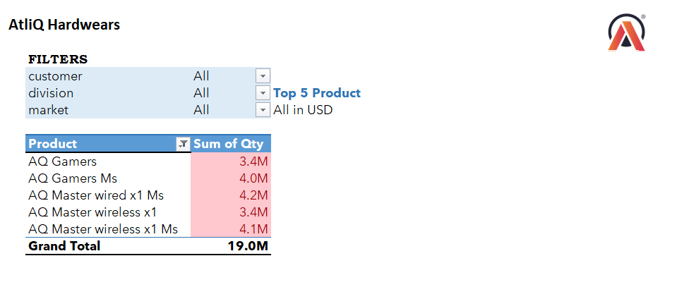

# Customer-Performance-Report-Atliq
Excel project analyzing Atliq Hardware’s customer performance using Power Query and PivotTable

This project was part of my Codebasics Data Analytics Bootcamp.  
I analyzed Atliq Hardware’s customer performance using Excel, Power Query, and Power Pivot.

## Key Insights
- AQ Mx NB grew **57% YoY** (highest growth).
- Division-level report shows overall growth of **3.04%**.
- Top 5 products by quantity: AQ Master wired x1 Ms, AQ Master wireless x1 Ms, AQ Gamers Ms, AQ Master wireless x1, AQ Gamers.
- Bottom 5 products by quantity: AQ HOME Allin1 Gen 2, AQ Home Allin1, AQ Gamer 1, AQ GEN Z, AQ Smash 2.
- New products launched in 2021 include AQ Gen Y, AQ Trigger, AQ Qwerty, AQ Lumina Ms, etc.
- India led 2021 sales with **$161M**.

## Dashboard Screenshots
### Top 10 Products

### Top 5 Product base on Qty sold 

### Bottom 5 Product base on Qty sold 

### Division Report

### Top 5 Countries

## Tools Used
- Excel (Data Cleaning,PivotTables, Power Query, Power Pivot)
- Data Cleaning & Transformation

## Next Steps
I will build a 3-year Profit & Loss (P&L) dashboard on a new dataset to showcase financial reporting skills.

